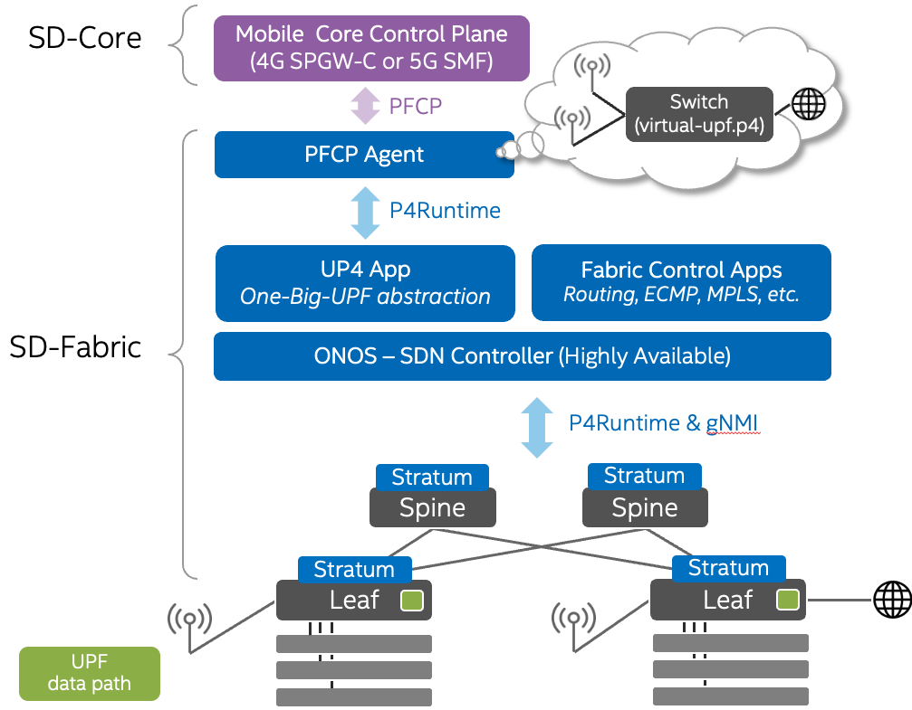

<!--
SPDX-FileCopyrightText: 2022-present Intel Corporation
SPDX-License-Identifier: Apache-2.0
-->

# Exercise 1: Tutorial environment
## Overview

Welcome to the first exercise of SD-Fabric tutorial.
In this exercise, we will get familiar with the environment that we are going to use for the rest of the tutorial.
We built a software emulated environment based on Docker,
such that all hands-on experiments can be easily set up within a single laptop.

The diagram above shows the high level architecture of SD-Fabric, which comprises four main components:

### Fabric switches
The data plane is emulated with [Mininet](http://mininet.org), 
a Python-based network emulator which creates a network of virtual hosts, switches, controllers, and links.
There are two leaves and two spines, each runs Stratum as the switch agent.
Few hosts are attached to the leaf switches so we can verify the connecetivity.
We also have a special `gNB` host, which will play the role of 5G base station later in the exercise.

### ONOS
We bring up ONOS with a pre-built `sdfabric-onos` image.
In addition to vanilla ONOS,
this image is built with all the ONOS applications we need to run SD-Fabric, such as

- `trellis-control` (forwarding),
- `up4` (5G UPF), and
- `fabric-tna` (pipeline).

### PFCP Agent
PFCP agent is a Go implementation of 3GPP Packet Forwarding Control Protocol.
It provides abstraction to / receives instruction from the 3GPP mobile core (4G SPGW-C or 5G SMF) and
fulfill those requests in the User Plane Function (UPF)

### Mock SMF (smf-sim)
We don't use a real 3GPP core component in this tutorial.
Instead, we create a mock SMF to emulate the behavior of the 3GPP core,
generating signals to PFCP agent when a mobile phone is connected / disconnected.

We will introduce PFCP agent and Mock SMF further in Exercise 3.
So don't worry too much if you are not yet familiar with these 3GPP components.

## System requirements
All exercises can be executed by installing the following dependencies:

- Docker v20+ (with docker-compose)
- make
- Python 3
- Bash-like Unix shell
- Wireshark (optional)

We recommend using **Linux** or **Intel MacOS** as your base system.
This tutorial hasn't been verified on Windows, and is known to have connectivity issue with M1 Mac.

## 1. Get this repo or pull latest changes

To work on the exercises you will need to clone this repo:

    cd ~
    git clone https://github.com/opennetworkinglab/sdfabric-tutorial

If the `sdfabric-tutorial` directory is already present, make sure to update its
content:

    cd ~/sdfabric-tutorial
    git pull origin main

## 2. Download / upgrade dependencies

Your system may have the most up-to-date version of the dependencies than we would
like to use for the exercises. You can download/upgrade to the latest version using the
following command:

    cd ~/ngsdn-tutorial
    make deps

This command will download all necessary Docker images (~1.5 GB) allowing you to
work offline. For this reason, we recommend running this step ahead of the
tutorial, with a reliable Internet connection.

## Using an IDE to work on the exercises

During the exercises you will need to write code and configuration in multiple languages such as
P4, Java, Python and JSON. While the exercises do not prescribe the use of any
specific IDE or code editor, we recommend using [IntelliJ IDEA
Community Edition](https://www.jetbrains.com/idea/) with
plugins for P4 syntax highlighting and Python development. We suggest using
IntelliJ IDEA especially when working on the ONOS app, as it provides code
completion for all ONOS APIs.

## Repo structure

This repo is structured as follows:

 - `config/` Configuration files for various sub-components
 - `mininet/` Mininet script to emulate a 2x2 leaf-spine fabric topology of
   `stratum_bmv2` devices
 - `solution/` Solutions for the exercises
 - `util/` Utility scripts

## Tutorial commands

To facilitate working on the exercises, we provide a set of make-based commands
to control the different aspects of the tutorial. Commands will be introduced in
the exercises, here's a quick reference:

| Make command        | Description                                            |
|---------------------|------------------------------------------------------- |
| `make deps`         | Pull and build all required dependencies               |
| `make start`        | Start Mininet and ONOS containers                      |
| `make start-upf`    | Start `pfcp-agent` and `smf-sim`
| `make stop`         | Stop all containers                                    |
| `make restart`      | Restart containers clearing any previous state         |
| `make reset`        | Reset the tutorial environment                         |
| `make onos-cli`     | Access the ONOS CLI (password: `rocks`, Ctrl-D to exit)|
| `make onos-log`     | Show the ONOS log                                      |
| `make mn-cli`       | Access the Mininet CLI (Ctrl-D to exit)                |
| `make mn-log`       | Show the Mininet log (i.e., the CLI output)            |
| `make mn-pcap`      | Dump packet on a particular Mininet host               |
| `make netcfg`       | Push netcfg.json file (network config) to ONOS         |

## Exercises

Click on the exercise name to see the instructions:

 1. [Environment Setup](./EXERCISE-1.md)
 2. [Basic Configurations](./EXERCISE-2.md)
 3. [P4-UPF](./EXERCISE-3.md)

More tutorial modules coming soon.

## Solutions

You can find solutions for each exercise in the [solution](solution) directory.
Feel free to compare your solution to the reference one whenever you feel stuck.