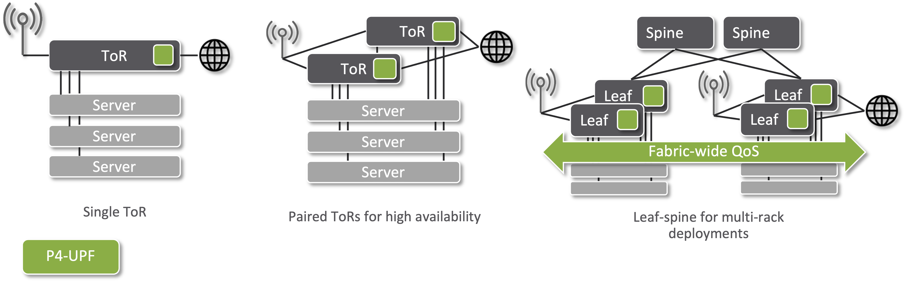

<!--
SPDX-FileCopyrightText: 2022-present Intel Corporation
SPDX-License-Identifier: Apache-2.0
-->

# WORK-IN-PROGRESS

This exercise is not ready to be used yet.

---

TODO:

Add steps for pfcpctl :

    ./util/pfcpctl service configure --remote-peer-addr pfcp-agent:8805 --n3-addr 172.16.1.254
    ./util/pfcpctl service associate
    ./util/pfcpctl session create --ue-pool 192.168.0.0/16 --gnb-addr 172.16.1.99
    ./util/pfcpctl session modify --ue-pool 192.168.0.0/16 --gnb-addr 172.16.1.99

Add steps for using UP4 CLI
    
    up4:read-flows


# Exercise 3: P4-UPF

SD-Fabric supports running a 5G mobile core User Plane Function (UPF) as part
of the switches' packet processing pipeline. Like the rest of the pipeline, this
is realized using P4 and for this reason we call this P4-UPF.

This exercise shows how to enable and configure P4-UPF, and how it can be
integrated with a 5G mobile core control plane via the PFCP standard interface.

This exercise requires familiarity with the 5G mobile network architecture and
protocols such has PFCP. For a gentle introduction to these concepts:
<https://5g.systemsapproach.org>


## Background


SD-Fabric can be used in 5G mobile networks to act as a UPF between 5G base
stations and external networks (e.g., Internet or LAN for local applications).
In cellular networks, to support mobility, base stations aggregate traffic from
User Equipments (UEs) using the GPRS Tunneling Protocol (GTP-U). The UPF main
function is to "terminate" such tunnels, encapsulating and decapsulating packets
before routing them to the next hop. To this end, we will show how to program
the SD-Fabric switches to act as a UPF, encapsulating packets for downlink
traffic (from Internet to the UE) in an additional IPv4+UDP+GTP-U header, and
decapsulating them for the uplink direction (from the UE to the Internet).

In this exercise we will focus mainly on the encap/decap function, but it's
important to note that SD'Fabric's P4-UPF implements a core set of features
capable of supporting requirements for a broad range of enterprise use cases,
such as accounting, downlink buffering, QoS, and slicing. For more information,
visit the official documentation at:
<https://docs.sd-fabric.org/master/advanced/p4-upf.html>

Before proceeding with the exercise instructions, it's important to cover some
important concepts of the P4-UPF architecture.


### Distributed data plane

In SD-Fabric we support different topologies to meet the requirements of
different deployment sizes: from a single rack with just one ToR/leaf switch, or
paired-leaves for redundancy, to N&times;M leaf-spine fabric for multi-rack
deployments. For this reason, P4-UPF is realized with a "distributed" data plane
where all leaf switches are programmed with the same UPF rules,
such that any leaf can terminate any GTP-U tunnel.



Using a distributed UPF data plane provides several benefits:

* Simplified deployment: base stations can be connected via any leaf switch.
* Minimum latency: the UPF function is applied as soon as packets enter the 
  fabric, without going through additional devices before reaching their final
  destination.
* Fast failover: when using paired-leaves, if one switch fails, the other can
  immediately take over as it is already programmed with the same rules.
* Fabric-wide QoS guarantees: packets are classified as soon as they hit the 
  first leaf. We then use a custom DSCP-based marking to enforce the same QoS
  rules on all hops. In case of congestion, flows deemed high priority are
  guaranteed to be treated as such by all switches.

### Integration with 5G core control plane

SD-Fabric's P4-UPF supports the standard 3GPP interface Packet Forwarding
Control Protocol (PFCP). As such it can be integrated with other 3GPP-compliant
mobile core solutions, such as the ONF's [SD-Core][sd-core] project or others.

Integration with the 5G core is realized with two components: a micro-service
named PFCP-Agent, which implements the PFCP protocol; and an ONOS application
named UP4 which abstracts the whole fabric as a "One-Big-UPF" and exposes an API
to PFCP-Agent for populating the UPF tables in the switches.

Similar to the One-Big-Router abstraction seen in the previous exercise, the
One-Big-UPG abstraction allows the 5G core control plane to be independent of
the underlying physical topology. By doing this, the deployment can be scaled up
and down, adding or removing racks and switches, without changing the mobile
core, which instead is given the illusion of controlling just one device.

Communication between PFCP-Agent and the UP4 app is done via P4Runtime. This is
the same API that ONOS uses to communicate with the underlying switches.
However, in this case, it is used between two control planes, the mobile core,
and the SDN controller. As a matter of fact, UP4 uses a P4 program describing a
"virtual UPF pipeline" (`virtual-upf.p4`) to formalize the forwarding model
described by PFCP as a series of match-action tables. This program doesn't run
on switches, but it's used as the schema to define the content of the P4Runtime
messages between PFCP-Agent and the UP4 app. On switches, we use `fabric.p4`,
which implements tables similar to `virtual-upf.p4` but optimized to satisfy the
resource constraints of Tofino, as well as tables for basic bridging, IP
routing, ECMP, and more. The UP4 app implements a P4Runtime server, like if it
were a switch, but instead it internally takes care of translating P4Runtime
rules from `virtual-upf.p4` to rules for the multiple physical switches running
`fabric.p4`.

The decision to separate the PFCP implementation from the UP4 app is due to the
logic required to implement the PFCP protocol can be common to many data path
realizations. Things like PFCP message parsing, functionalities such as IP
address allocation, usage reporting rules, and other state bookkeeping, can be
re-used by other UPF implementations.

TODO: clarify terminology up4, vs P4-UPF

Code for the UP4 app, including the virtual UPF P4 program can be found at:
<https://github.com/omec-project/up4>

Code for PFCP-Agent can be found at:
<https://github.com/omec-project/upf>

## Exercise Overview

In this exercise, we use the same 2x2 topology as in the previous exercise. To
make things simpler, we will not bring up the whole 5G core control plane.
Instead, we will use a tool named `pfcp-sim` to simulate the behavior of the 5G
Session Management Function (SMF), i.e., the component of the 5G architecture
responsible for controlling the UPF. `pfcp-sim` offers a CLI tool named
`pfcpctl` to generate the necessary PFCP messages to set up termination rules
for one or more UEs.

We will try to emulate actual UEs. Instead, we will verify the behavior the UPF
by generating and sniffing packets at a Mininet host named `gnb` attached to
`leaf1`. This host represents a radio base station (usually referred to as
gNodeB in 5G parlance). We want to make sure that GTP-U traffic sent and
received by this host is correctly encapsulated/decapsulated by leaf switches.

In this exercise, you will learn how to:

* Start and configure PFCP-Agent and the UP4 app
* Use the `pfcpctl` tool to manually set up rules to UEs
* Send test traffic and observe whether it is being encapsulated/decapsulated correctly

### IP network setup

To configure P4-UPF we need to define the following IP subnets and addresses:

- UE IPv4 subnet: UEs attaching to the mobile network will be assigned an IP address in this subnet. Assignment can be up to the SMF or UPF. In this exercise, it is up to the SMF. This can be any arbitrary subnet.
- UPF IPv4 address: this is also called the N3 address in the 5G architecture. It is the IP address used to identify the UPF in the outer IP header of GTP-U packets. Since we are using fabric switches to behave as a UPF, in SD-Fabric we use the  interface gateway address specified in the netcfg JSON (i.e., the same address used by data plane hosts to ping the fabric).
- gNodeB IPv4 address: the IP address of the base station (`gnb` host in our case) in the N3 interface. Can be any address as long as it is routable by the fabric.

- UE IPv4 subnet: 192.168.0.0/16
- UPF IPv4 address: 172.16.1.254/24
- gNodeB IPv4 address: 172.16.1.99/24

TODO: add topo diagram

## 1. Start ONOS and Mininet

ONOS and Mininet should already be running from the previous exercise. If this
is not the case, follow the steps in Exercise 2, recapped here for convenience:

    $ make start

Wait for ONOS to start all of its subsystems (approximately 1 minute), then push
the netcfg to discover switches and install rules for basic forwarding:

    $ make netcfg

## 2. Start PFCP-Agent and configure UP4

### Start PFCP-Agent

Use the following command to start PFCP-Agent:

**IMPORTANT**: please notice the `-upf` suffix!

    $ make start-upf

Like for ONOS and Mininet we use Docker compose to start the PFCP-Agent container.
When starting PFCP-Agent, we need to pass a JSON file.

```json
{
  "enable_p4rt": true,
  "log_level": "info",
  "cpiface": {
    "ue_ip_pool": "192.168.0.0/16"
  },
  "p4rtciface": {
    "p4rtc_server": "onos1",
    "p4rtc_port": "51001",
    "access_ip": "172.16.1.254/32"
  }
}
```

This file is telling PFCP-Agent to connect to the P4Runtime server available at
the hostname `onos1` and port 51001 (default UP4 port). You can also notice the
UE subnet (192.168.0.0/16) and UPF IPv4 address (172.16.1.254).

There are more configuration values, for more information please check the official doc:

### Configure UP4

Next, we need to configure the UP4 app. The app is already running, as it is specified to be executed at boot in the `ONOS_APPS` env defined in `.env`. For UP4 to be able to accept new P4Runtime connections, we need to specify a few parameters using the nectfg. Use the following command to push a a JSON:

**IMPORTANT**: please notice the `-up4` suffix!

    $ make netcfg-up4

Enables a new interface named `leaf1-7-gnb`. This is the interface facing the `gnb`. Notice how we assigned the desired UPF IPv4 address as the interface address (172.16.1.254/24).

Which devices should be programmed with UPF rules: leaf1 and leaf2

#### Aside: fabric.p4 profiles

Device specified in the UP4 netcfg must be programmed with the fabric-upf pipeconf.


### Verify logs

To verify that P4-UPF is correctly running check the PFCP-Agent log:

TODO show

Show the ONOS log:

Use the ONOS CLI:

We don;t go into the details of the pipeline at high level, the interface table is the one admitting packets to the UPF portion of the UPF pipeline.

Show uplink and downlink interfaces.

Show flow rules -- same rules programmed on both leaf1 and leaf2

#### Check gnb connectivity

TODO: ping from gnb to discover host, and ping from host on leaf2

Check the interface configuration. In this topology we want `segmentrouting` to
forward traffic based on two IP subnets:

    onos> interfaces
    leaf1-3: port=device:leaf1/3 ips=[10.0.100.254/24] mac=00:AA:00:00:00:01 vlanUntagged=100
    leaf2-3: port=device:leaf2/3 ips=[10.0.200.254/24] mac=00:AA:00:00:00:02 vlanUntagged=200

Check that the `enodeb` and `h3` hosts have been discovered:

    onos> hosts
    id=00:00:00:00:00:10/None, mac=00:00:00:00:00:10, locations=[device:leaf1/3], auxLocations=null, vlan=None, ip(s)=[10.0.100.1], ..., name=enodeb, ..., provider=host:org.onosproject.netcfghost, configured=true
    id=00:00:00:00:00:20/None, mac=00:00:00:00:00:20, locations=[device:leaf2/3], auxLocations=null, vlan=None, ip(s)=[10.0.200.1], ..., name=h3, ..., provider=host:org.onosproject.netcfghost, configured=true

`provider=host:org.onosproject.netcfghost` and `configured=true` are indications
that the host entry was created by `netcfghostprovider`.

## 4. Verify IP connectivity between PDN and gNodeB

Since the two hosts have already been discovered, they should be pingable.

Using the Mininet CLI (`make mn-cli`) start a ping between `enodeb` and `h3`:

    mininet> enodeb ping h3
    PING 10.0.200.1 (10.0.200.1) 56(84) bytes of data.
    64 bytes from 10.0.200.1: icmp_seq=1 ttl=62 time=1053 ms
    64 bytes from 10.0.200.1: icmp_seq=2 ttl=62 time=49.0 ms
    64 bytes from 10.0.200.1: icmp_seq=3 ttl=62 time=9.63 ms
    ...

## 5. Start scripts to generate and sniff packets at gNodeB

We have created two Python scripts to emulate a host sending downlink
traffic to the UEs, and the gNodeB, expecting to receive the
same traffic but GTP-encapsulated.

In a new terminal window, start the [send-udp.py] script on the `h3` host:

    $ util/mn-cmd h3 /mininet/send-udp.py
    Sending 5 UDP packets per second to 192.168.0.1...

[util/mn-cmd] is a convenience script to run commands on mininet hosts when
using multiple terminal windows.

[mininet/send-udp.py][send-udp.py] generates packets with destination
IPv4 address `192.168.01` (UE address). In the rest of the exercise we
will insert the necessary rules to perform GTP
encapsulation. For now, this traffic is dropped at `leaf2`.

On a second terminal window, start the [recv-gtp.py] script on the `enodeb`
host:

```
$ util/mn-cmd enodeb /mininet/recv-gtp.py   
Will print a line for each UDP packet received...
```

[mininet/recv-gtp.py][recv-gtp.py] simply sniffs packets received and prints
them on screen, informing if the packet is GTP encapsulated or not. You should
see no packets being printed for the moment.

#### Use ONOS UI to visualize traffic

Using the ONF Cloud Tutorial Portal, access the ONOS UI.
If you are running a VM on your laptop, open up a browser
(e.g. Firefox) to <http://127.0.0.1:8181/onos/ui>.

When asked, use the username `onos` and password `rocks`.

To show hosts, press <kbd>H</kbd>. To show real-time link utilization, press
<kbd>A</kbd> multiple times until showing "Port stats (packets / second)".

You should see traffic (5 pps) on the link between the `h3` host and `leaf2`,
but not on other links. **Packets are dropped at switch `leaf2` as this switch
does not know how to route packets with IPv4 destination `192.168.01`.**

## 7. Use pfcpctl to insert GTp-U termination rules

Finally, it is time to instruct `leaf1` to encapsulate traffic with a GTP tunnel
header. To do this, we will insert a special table entry in the "SPGW portion"
of the [fabric.p4] pipeline, implemented in file [spgw.p4]. Specifically, we
will insert one entry in the [dl_sess_lookup] table, responsible for handling
downlink traffic (i.e., with match on the UE IPv4 address) by setting the GTP
tunnel info which will be used to perform the encapsulation (action
`set_dl_sess_info`).

**NOTE:** this version of spgw.p4 is from ONOS v2.2.2 (the same used in this
exercise). The P4 code might have changed recently, and you might see different
tables if you open up the same file in a different branch.

To insert the flow rule, we will not use an app (which we would have to
implement from scratch!), but instead, we will use the ONOS REST APIs. To learn
more about the available APIs, use the following URL to open up the
automatically generated API docs from your running ONOS instance:
<http://127.0.0.1:8181/onos/v1/docs/>

The specific API we will use to create new flow rules is `POST /flows`,
described here:
<http://127.0.0.1:8181/onos/v1/docs/#!/flows/post_flows>

This API takes a JSON request. The file
[mininet/flowrule-gtp.json][flowrule-gtp.json] specifies the flow rule we
want to create. This file is incomplete, and you need to modify it before we can
send it via the REST APIs.

1. Open up file [mininet/flowrule-gtp.json][flowrule-gtp.json].

   Look for the `"selector"` section that specifies the match fields:
   ```
   "selector": {
     "criteria": [
       {
         "type": "IPV4_DST",
         "ip": "<INSERT HERE UE IP ADDR>/32"
       }
     ]
   },
   ...
   ```
    
2. Modify the `ip` field to match on the IP address of the UE (192.168.01).
    
    Since the `dl_sess_lookup` table performs exact match on the IPv4
    address, make sure to specify the match field with `/32` prefix length.
    
    Also, note that the `set_dl_sess_info` action, is specified as
    `PROTOCOL_INDEPENDENT`. This is the ONOS terminology to describe custom
    flow rule actions. For this reason, the action parameters are specified
    as byte strings in hexadecimal format:
    
    * `"teid": "BEEF"`: GTP tunnel identifier (48879 in decimal base)
    * `"s1u_enb_addr": "0a006401"`: destination IPv4 address of the
      GTP tunnel, i.e., outer IPv4 header (10.0.100.1). This is the address of
      the gNodeB.
    * `"s1u_sgw_addr": "0a0064fe"`: source address of the GTP outer IPv4
      header (10.0.100.254). This is the address of the switch interface
      configured in SD-Fabric.
    
3. Save the [flowrule-gtp.json] file.

4. Push the flow rule to ONOS using the REST APIs.

   On a terminal window, type the following commands:
   
   ```
   $ make flowrule-gtp
   ```

   This command uses `cURL` to push the flow rule JSON file to the ONOS REST API
   endpoint. If the flow rule has been created correctly, you should see an
   output similar to the following one:

   ```
   *** Pushing flowrule-gtp.json to ONOS...
   curl --fail -sSL --user onos:rocks --noproxy localhost -X POST -H 'Content-Type:application/json' \
                   http://localhost:8181/onos/v1/flows?appId=rest-api -d@./mininet/flowrule-gtp.json
   {"flows":[{"deviceId":"device:leaf1","flowId":"54606147878186474"}]}

   ```

5. Check the gNodeB process. You should see that the received packets
   are now GTP encapsulated!

    ```
    [...] 727 bytes: 10.0.100.254 -> 10.0.100.1, is_gtp_encap=True
        Ether / IP / UDP / GTP_U_Header / IP / UDP 10.0.200.1:80 > 192.168.01:400 / Raw
    ```

## Congratulations!

You have completed the eighth exercise! You were able to use fabric.p4 and
SD-Fabric to encapsulate traffic in GTP tunnels and to route it across the fabric.

[sd-core]: https://opennetworking.org/sd-core/
[topo-gtp.py]: mininet/topo-gtp.py
[netcfg-gtp.json]: mininet/netcfg-gtp.json
[send-udp.py]: mininet/send-udp.py
[recv-gtp.py]: mininet/recv-gtp.py
[util/mn-cmd]: util/mn-cmd
[fabric.p4]: https://github.com/opennetworkinglab/onos/blob/2.2.2/pipelines/fabric/impl/src/main/resources/fabric.p4
[spgw.p4]: https://github.com/opennetworkinglab/onos/blob/2.2.2/pipelines/fabric/impl/src/main/resources/include/spgw.p4
[dl_sess_lookup]: https://github.com/opennetworkinglab/onos/blob/2.2.2/pipelines/fabric/impl/src/main/resources/include/spgw.p4#L70
[flowrule-gtp.json]: mininet/flowrule-gtp.json
